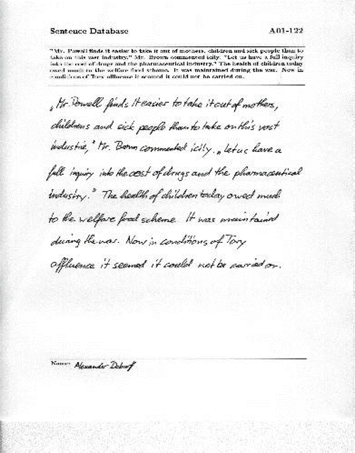
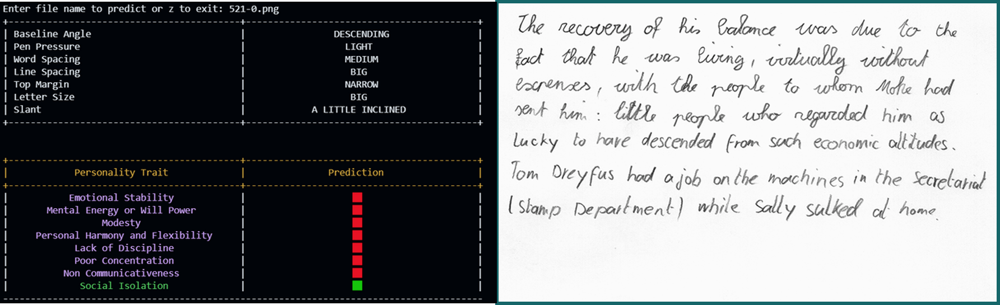
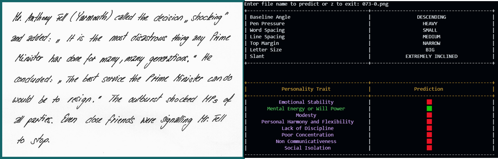

# Handwriting-Based Psychological Assessment with Machine Learning

## Overview

This project applies machine learning to automate graphological analysis, predicting personality traits from handwriting. By processing handwritten samples, extracting key features, and using machine learning models, the system provides psychological insights.

## Table of Contents

- [Installation](#installation)
- [Usage](#usage)
- [Dataset](#dataset)
  - [Data Acquisition](#data-acquisition)
  - [Image Processing](#image-processing)
- [Features](#features)
  - [Pre-Processing](#pre-processing)
  - [Feature Extraction](#feature-extraction)
  - [Personality Traits](#personality-traits)
- [Results](#results)
- [Future Scope](#future-scope)
- [Contributing](#contributing)
- [License](#license)

## Installation

1. Clone the repository:
   ```bash
   git clone https://github.com/yourusername/handwriting-analysis.git
   ```
2. Navigate to the project directory:
   ```bash
   cd HBPA
   ```
3. Install the required packages:
   ```bash
   pip install -r requirements.txt
   ```

## Usage

1. Place handwriting samples in the `data/samples` directory.
2. Run the analysis script:
   ```bash
   python train_predict_v3.py
   ```
3. View the results in the terminal.

## Dataset

### Data Acquisition

The handwriting data comes from the IAM Handwriting Database by the Research Group on Computer Vision and Artificial Intelligence, INF University of Bern, Switzerland. The dataset includes:

- 1,538 pages of scanned handwritten text.
- 657 different writers.
- Each sample is annotated with psychological traits through manual document analysis.
- [Download the dataset here](https://fki.tic.heia-fr.ch/databases/download-the-iam-handwriting-database).

  

  *Sample data from the IAM Handwriting Database*

### Image Processing

- Images are cropped and saved as PNGs via an automated script.
- Width: 850 pixels, Height: variable based on handwriting content.

  

  *Data sample after image processing*

## Features

### Pre-Processing

- Resolution enhancement
- Noise reduction
- Grayscale conversion
- Contour detection
- Warp affine transformation
- Horizontal and vertical projections

### Feature Extraction

- Baseline
- Top margin
- Letter size
- Line spacing
- Word spacing
- Pen pressure
- Slant angle

### Personality Traits

The system predicts the following psychological traits:

- Emotional Stability
- Mental Energy/Will Power
- Modesty
- Personal Harmony and Flexibility
- Lack of Discipline
- Poor Concentration
- Non-communicativeness
- Social Isolation

## Results

Below are sample outputs showing predicted traits based on handwriting:


*Output 1*


*Output 2*

## Future Scope

### User Interface Development

Plans to create an intuitive UI to make handwriting analysis accessible to the general public.

### CNN Integration

Shift from Support Vector Machines (SVM) to Convolutional Neural Networks (CNN) for more accurate and direct handwriting analysis.

### Performance Optimization

Work on reducing execution time while maintaining high accuracy for real-time applications.

## Contributing

1. Fork this repository.
2. Create a new branch:
   ```bash
   git checkout -b feature-branch
   ```
3. Implement your changes and commit:
   ```bash
   git commit -m "Add new feature"
   ```
4. Push the changes:
   ```bash
   git push origin feature-branch
   ```
5. Open a pull request.

## License

This project is licensed under the MIT License. See the [LICENSE](LICENSE) file for more details.
